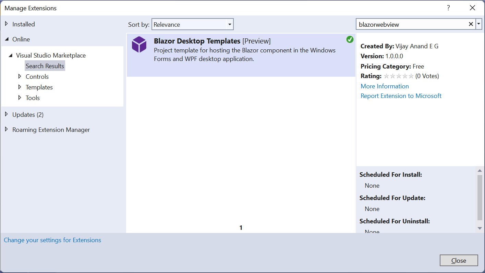
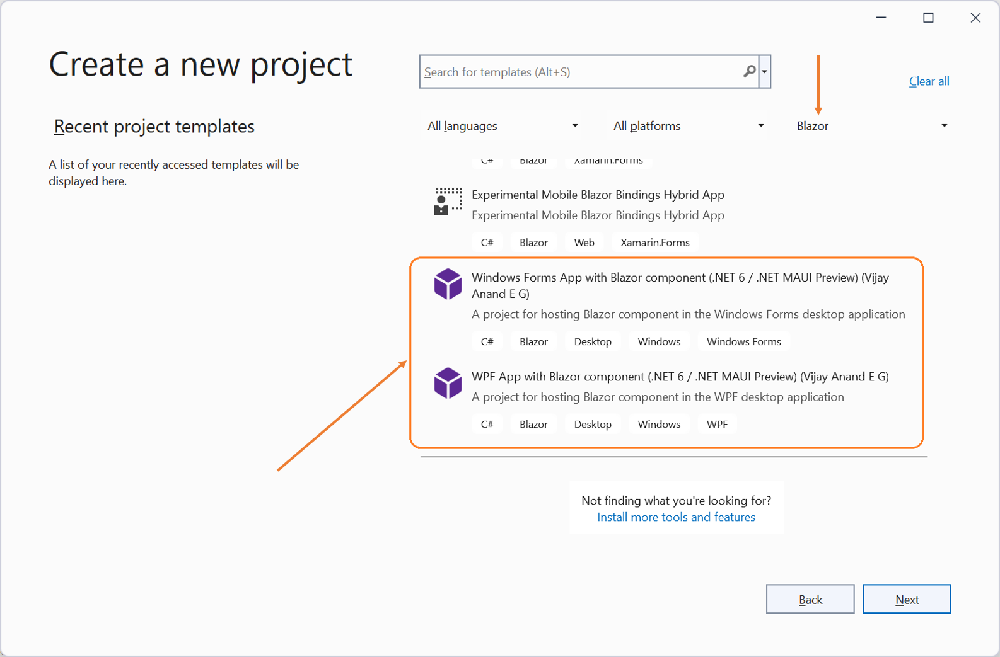
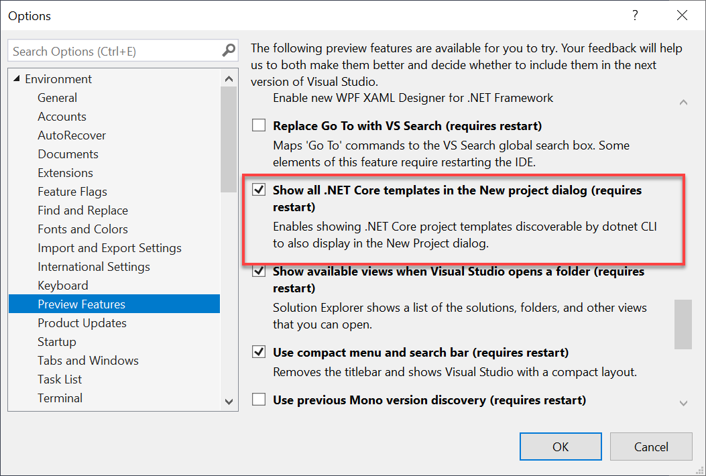

## Blazor Hybrid Windows Desktop Project Templates

### Blazor desktop project templates for Windows Forms and WPF

|App Model|Stable Channel|Preview Channel|
|:---:|:---:|:---:|
|[Unified Package](https://www.nuget.org/packages/VijayAnand.BlazorTemplates/)|[](https://www.nuget.org/packages/VijayAnand.BlazorTemplates/)<br />[](https://marketplace.visualstudio.com/items?itemName=egvijayanand.blazor-desktop-templates)| - <!--[](https://www.nuget.org/packages/VijayAnand.BlazorTemplates/absoluteLatest)-->|
|[Windows Forms](https://www.nuget.org/packages/VijayAnand.WindowsForms.Blazor/)|[](https://www.nuget.org/packages/VijayAnand.WindowsForms.Blazor/)| - <!--[](https://www.nuget.org/packages/VijayAnand.WindowsForms.Blazor/absoluteLatest)-->|
|[WPF](https://www.nuget.org/packages/VijayAnand.Wpf.Blazor/)|[](https://www.nuget.org/packages/VijayAnand.Wpf.Blazor/)| - <!--[](https://www.nuget.org/packages/VijayAnand.Wpf.Blazor/absoluteLatest)-->|

Templates made available for working with **Blazor components in desktop applications such as Windows Forms and WPF**.

Also available in an unified template package.

Join me on [**Developer Thoughts**](https://egvijayanand.in/), an exclusive blog for .NET MAUI and Blazor, for articles on working with these templates and much more.

Now published as Visual Studio 2022 Extension, can be downloaded from the [VS Marketplace](https://marketplace.visualstudio.com/items?itemName=egvijayanand.blazor-desktop-templates) and then installed with VSIX installer or even an easy way, install and manage directly from within Visual Studio IDE itself (Extensions -> Manage Extensions or `Alt + X + M` shortcut). To find this extension, search with the `blazorwebview` keyword. Refer to the below screenshot.

The Blazor Hybrid Windows Desktop Templates VS extension is now supported on both **x64 and ARM64** installations of Visual Studio 2022 (v4.3.0.0 or higher) and 2026 Insiders release (v6.6.0.0). Happy coding!

*Consequently, the minimum supported version of Visual Studio 2022 will be v17.6 or higher.*

**The v6.6.0.0 VS extension is now compatible with the Visual Studio 2026 Insiders release v18.0.0**



For CLI users, commands to install the project template:

Unified Template:

```shell
dotnet new install VijayAnand.BlazorTemplates
```

Can also be installed separately.

```shell
dotnet new install VijayAnand.WindowsForms.Blazor
```

```shell
dotnet new install VijayAnand.Wpf.Blazor
```

To update the template package:

```shell
dotnet new update --check-only
```
```shell
dotnet new update
```

And from [v4.3.0](https://www.nuget.org/packages/VijayAnand.BlazorTemplates/4.3.0) of the template package, support for XML-based solution file (slnx) format.

* SLNX Solution File Format (Short notation: `-slnx`):

  Introduces support for the new, simplified, and easily understandable XML-based solution file format.

  This would be an explicit option since the SLNX feature is currently in the preview stage and is only supported on VS2022.

  `-slnx` | `--use-slnx` - Default value is `false`.

  ```shell
  dotnet new winforms-blazor -o MyApp -slnx
  ```

  ```shell
  dotnet new wpf-blazor -o MyApp -slnx
  ```

And from [v4.4.0](https://www.nuget.org/packages/VijayAnand.BlazorTemplates/4.4.0) of the template package, support for adding a reference to the MVVM toolkit.

* Include MVVM Toolkit (Short notation: `-imt`):

  Introduces an option to add a reference to the [CommunityToolkit.Mvvm](https://www.nuget.org/packages/CommunityToolkit.Mvvm) NuGet package to work with MVVM.

  `-imt` | `--include-mvvm-toolkit` - Default value is `false`.

  ```shell
  dotnet new winforms-blazor -o MyApp -imt
  ```

  ```shell
  dotnet new wpf-blazor -o MyApp -imt
  ```

#### Project names referenced by these templates:

Windows Forms: **winforms-blazor**

WPF: **wpf-blazor**

So, .NET CLI command to create a new project from your favorite terminal would be as follows:

By default, this creates a project that targets `.NET 9`.

To create projects targeting different supported/preview version of .NET, make use of the Framework parameter (`--framework` | `-f`) that takes `net8.0` / `net9.0` / `net10.0` as its options (with `net9.0` being the default value, if not specified).

WinForms:

Being the default value, framework parameter is optional for `.NET 9`.

```shell
dotnet new winforms-blazor
```

```shell
dotnet new winforms-blazor -f net8.0
```

.NET 10 Preview:

```shell
dotnet new winforms-blazor -f net10.0
```

WPF:

Being the default value, framework parameter is optional for `.NET 9`.

```shell
dotnet new wpf-blazor
```

```shell
dotnet new wpf-blazor -f net8.0
```

.NET 10 Preview:

```shell
dotnet new wpf-blazor -f net10.0
```

Optionally, to abstract Razor components as a separate Razor Class Library (RCL), pass the below parameter while creating the project:

`-rcl` | `--razor-class-library` - Default value is `false`

For WinForms:

```shell
dotnet new winforms-blazor -rcl
```

For WPF:

```shell
dotnet new wpf-blazor -rcl
```

Optionally, to make use of NuGet Central Package Management (CPM) feature, pass the below parameter while creating the project (_Supported from v3.5.0 onwards_):

`-cpm` | `--central-pkg-mgmt` - Default value is `false`

For WinForms:

```shell
dotnet new winforms-blazor -cpm
```

For WPF:

```shell
dotnet new wpf-blazor -cpm
```

Project options can also be used in combination like `-rcl`, `-cpm`, and `-slnx`.

Has support for Item Templates too:

* Windows Form with BlazorWebView
  - Named as `winforms-bwv`
* WPF Window with BlazorWebView
  - Named as `wpf-bwv`

Both of these templates require a parameter:

* `-n` | `--name` - The Name of the Item to create

<!--
* `-na` | `--namespace` - The Namespace for the Item to create
-->

Note:

*Make sure the project dependencies are restored before creating a new item from these templates.*

<!--
*While working with .NET 7 or higher SDK, the namespace parameter in short notation needs to be passed as `-p:na` (i.e., it needs to be prefixed with `-p:`).*
-->

```shell
dotnet new winforms-bwv -n MyForm
```

```shell
dotnet new wpf-bwv -n MyWindow
```

To uninstall the template package:

```shell
dotnet new uninstall VijayAnand.BlazorTemplates
```

To run the project, it does depend on the WebView2 runtime, which can be downloaded from here:

https://developer.microsoft.com/en-us/microsoft-edge/webview2/#download-section

Or can easily be installed with [Maui Check](https://github.com/Redth/dotnet-maui-check) tool.

#### Templates within Visual Studio

After installing the CLI template, optionally, this can be made available in the `New Project` dialog within Visual Studio for an integrated experience.

> **Pro Tip:** Search/Filter with the **Blazor** keyword to quickly locate these template in the VS _Create Project_ dialog.



<!--
Users on VS2019 (ver. 16.8+) need to enable the option as shown in the below screenshot (Tools -> Options / `Alt + T + O`) and then restart the Visual Studio instance for this to take effect.

_And in case of Visual Studio 2022, the option of listing the installed .NET CLI templates within IDE is enabled by default._


-->
