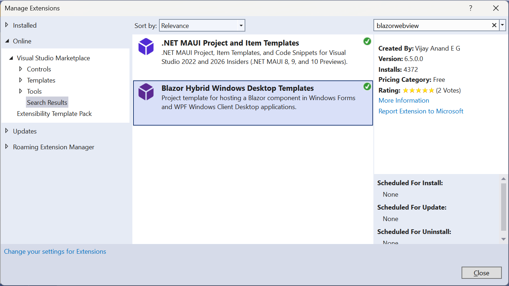
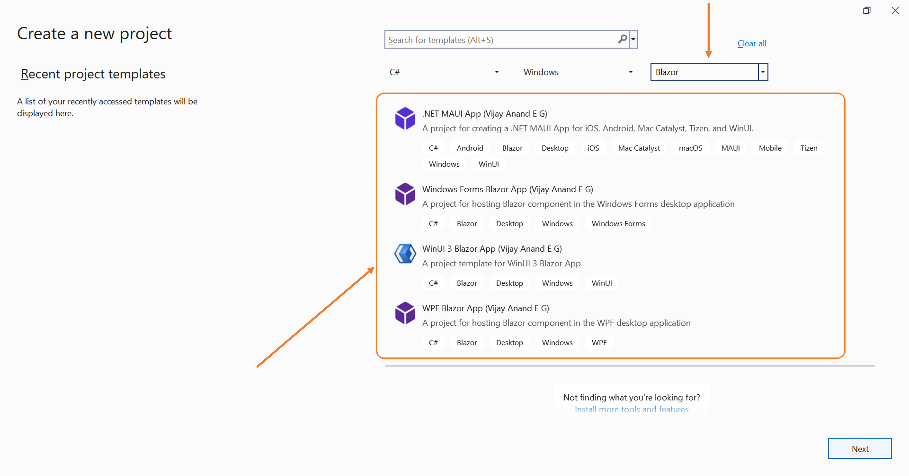

## Blazor Desktop Project Templates

### Blazor desktop project templates for Windows Forms and WPF

|App Model|Stable Channel|Preview Channel|
|:---:|:---:|:---:|
|[Unified Package](https://www.nuget.org/packages/VijayAnand.BlazorTemplates/)|[](https://www.nuget.org/packages/VijayAnand.BlazorTemplates/)<br />[](https://marketplace.visualstudio.com/items?itemName=egvijayanand.blazor-desktop-templates)|[](https://www.nuget.org/packages/VijayAnand.BlazorTemplates/absoluteLatest)|
|[Windows Forms](https://www.nuget.org/packages/VijayAnand.WindowsForms.Blazor/)|[](https://www.nuget.org/packages/VijayAnand.WindowsForms.Blazor/)|[](https://www.nuget.org/packages/VijayAnand.WindowsForms.Blazor/absoluteLatest)|
|[WPF](https://www.nuget.org/packages/VijayAnand.Wpf.Blazor/)|[](https://www.nuget.org/packages/VijayAnand.Wpf.Blazor/)|[](https://www.nuget.org/packages/VijayAnand.Wpf.Blazor/absoluteLatest)|

Templates made available for working with **Blazor components in desktop applications such as Windows Forms and WPF**.

Also available in an unified template package.

Join me on [**Developer Thoughts**](https://egvijayanand.in/), an exclusive blog for .NET MAUI and Blazor, for articles on working with these templates and much more.

Now published as Visual Studio 2022 Extension, can be downloaded from the [VS Marketplace](https://marketplace.visualstudio.com/items?itemName=egvijayanand.blazor-desktop-templates) and then installed with VSIX installer or even an easy way, install and manage directly from within Visual Studio IDE itself (Extensions -> Manage Extensions or `Alt + X + M` shortcut). To find this extension, search with the `blazorwebview` keyword. Refer to the below screenshot.



For CLI users, commands to install the project template:

Unified Template:

```shell
dotnet new install VijayAnand.BlazorTemplates
```

Can also be installed separately.

```shell
dotnet new install VijayAnand.WindowsForms.Blazor
```

```shell
dotnet new install VijayAnand.Wpf.Blazor
```

To update the template package:

```shell
dotnet new update --check-only
```
```shell
dotnet new update
```

#### Project names referenced by these templates:

Windows Forms: **winforms-blazor**

WPF: **wpf-blazor**

So, .NET CLI command to create a new project from your favorite terminal would be as follows:

To create projects targeting different supported version of .NET, make use of the newly introduced `--framework` | `-f` parameter that takes `net6.0` / `net7.0` / `net8.0` as its options (with `net7.0` being the default value, if not specified).

```shell
dotnet new winforms-blazor -f net6.0
```

```shell
dotnet new winforms-blazor -f net7.0
```

```shell
dotnet new winforms-blazor -f net8.0
```

```shell
dotnet new wpf-blazor -f net6.0
```

```shell
dotnet new wpf-blazor -f net7.0
```

```shell
dotnet new wpf-blazor -f net8.0
```

To uninstall the template package:

```shell
dotnet new uninstall VijayAnand.BlazorTemplates
```

To run the project, it does depend on the WebView2 runtime, which can be downloaded from here:

https://developer.microsoft.com/en-us/microsoft-edge/webview2/#download-section

Or can easily be installed with [Maui Check](https://github.com/Redth/dotnet-maui-check) tool.

#### Templates within Visual Studio

After installing the CLI template, optionally, this can be made available in the `New Project` dialog within Visual Studio for an integrated experience.

> **Pro Tip:** Search/Filter with the **Blazor** keyword to quickly locate these template in the VS _Create Project_ dialog.



<!--
Users on VS2019 (ver. 16.8+) need to enable the option as shown in the below screenshot (Tools -> Options / `Alt + T + O`) and then restart the Visual Studio instance for this to take effect.

_And in case of Visual Studio 2022, the option of listing the installed .NET CLI templates within IDE is enabled by default._


-->
